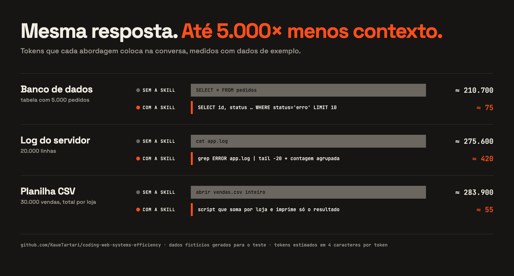

# coding-web-systems-efficiency

**Uma skill para o Claude programar sites e sistemas gastando muito menos tokens.**

Sabe quando a sessão fica lenta, o limite de uso acaba no meio do projeto ou o Claude "esquece" o que estava fazendo? Quase sempre é contexto inchado: a tabela inteira do banco no chat, o log de 20 mil linhas, o `npm install` completo, o arquivo reescrito do zero para mudar três linhas. Tudo isso é pago de novo a cada mensagem seguinte.

Esta skill ensina o Claude a pegar só o que precisa.



<sub>Medição feita com dados fictícios gerados para o teste (5.000 pedidos em SQLite, log com 20.000 linhas, CSV com 30.000 vendas). Tokens estimados em 4 caracteres por token. O código da imagem está em [`docs/src/`](docs/src/).</sub>

---

## O que ela faz

Toda vez que o Claude for criar, editar, depurar ou revisar código, a skill orienta ele a:

- **Escrever só o necessário.** Edita o trecho exato em vez de reescrever o arquivo, não repete código já aplicado e responde em listas curtas.
- **Ler o projeto com mira.** Busca o nome da função, rota ou erro antes de abrir arquivos, lê só as linhas relevantes e nunca abre `node_modules`, `dist`, lockfiles ou minificados.
- **Consultar o banco sem trazer tabelas inteiras.** Lê a estrutura primeiro, pega só as colunas necessárias com `LIMIT` e usa `COUNT`/`GROUP BY` em vez de contar linhas no olho. Não traz dados pessoais sem necessidade e pede confirmação antes de alterar ou apagar dados.
- **Filtrar logs.** Por erro e pelo horário do problema, só as últimas linhas, com erros repetidos agrupados.
- **Resumir planilhas, CSV e JSON com script.** Cabeçalho e algumas linhas para entender o formato; o cálculo roda fora do chat e só o resultado entra.
- **Rodar só os testes da parte alterada** enquanto trabalha, e a suíte completa uma vez no fim.
- **Conferir o site no navegador sem inflar o contexto.** Lê a página como texto e usa screenshot só quando o que importa é o visual.
- **Economizar em sistemas com IA por dentro.** Para chatbots, geradores de texto e agentes que chamam a API do Claude: modelo certo para cada tarefa, prompt caching, `effort`, histórico enxuto, Batch API e controle de gastos.
- **Lembrar você das boas práticas de sessão**, em uma linha e na hora certa: sessão nova a cada funcionalidade, conectores desligados, `CLAUDE.md` curto no projeto.

Economia nunca vale pular uma verificação: a skill deixa claro que um bug que volta custa mais que um teste bem escolhido.

## Instalação

### Claude Code

```bash
git clone https://github.com/KaueTartari/coding-web-systems-efficiency.git
cp -r coding-web-systems-efficiency/coding-web-systems-efficiency ~/.claude/skills/
```

Para usar só em um projeto, copie para `.claude/skills/` dentro dele. A skill é acionada sozinha quando o pedido envolve programação, ou manualmente com `/coding-web-systems-efficiency`.

### Claude.ai (app e web)

1. Compacte a pasta `coding-web-systems-efficiency/` (a que contém o `SKILL.md`) em um `.zip`.
2. Vá em **Configurações → Capacidades → Skills** e faça o upload.

### Qualquer outra IA

Copie o conteúdo do [`SKILL.md`](coding-web-systems-efficiency/SKILL.md) (sem o bloco `---` do topo) e cole nas instruções do projeto ou no system prompt. Os arquivos em `references/` podem ser colados junto se a ferramenta aceitar instruções longas.

## Estrutura

```
coding-web-systems-efficiency/
├── coding-web-systems-efficiency/
│   ├── SKILL.md                ← regras principais (sempre carregadas)
│   └── references/
│       ├── comandos.md         ← comandos prontos: Postgres, MySQL, SQLite, MongoDB,
│       │                         Docker, PM2, Nginx, CSV, JSON, testes, build, git
│       └── api-claude.md       ← só para sistemas que chamam a API do Claude
├── docs/                       ← imagem e código da comparação
├── README.md
└── LICENSE
```

Os arquivos de `references/` só são lidos quando a tarefa precisa deles, então não pesam no dia a dia.

## Contribuindo

Conhece um comando ou hábito que desperdiça tokens e a skill ainda não cobre? Abra uma issue com o exemplo ou mande um pull request com a regra e a alternativa enxuta.

## Créditos e licença

Criada por **[Kauê Tartari](https://github.com/KaueTartari)**, com auxílio do Claude (Anthropic) na redação.

Distribuída sob a licença [Creative Commons Atribuição 4.0 Internacional (CC BY 4.0)](LICENSE). Você pode usar, adaptar e redistribuir, inclusive comercialmente, desde que dê o crédito.
